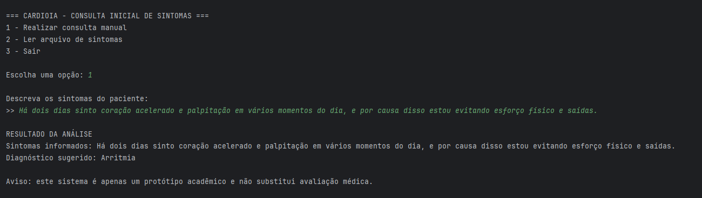
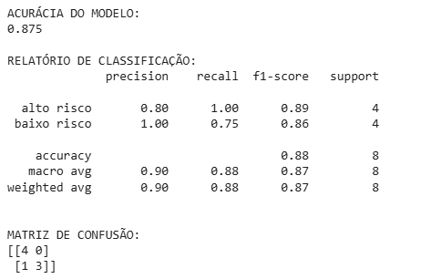

# FIAP - Faculdade de Informática e Administração Paulista

<p align="center">
<a href= "https://www.fiap.com.br/"></a>
</p>

<br>

# CardioIA — Sistema Inteligente de Triagem de Sintomas

## Nome do grupo

## 👨‍🎓 Integrantes: 
- <a href="#">Vitor Augusto Prado Guisso</a>
- <a href="#">Vinícius Pereira Santana</a>

## 👩‍🏫 Professores:

### Tutor(a)
- [Caique Nonato da Silva Bezerra](.)

### Coordenador(a)
- [Andre Godoi Chiovato](https://www.linkedin.com/company/inova-fusca)
---

## 📜 Descrição

O projeto **CardioIA** tem como objetivo simular um sistema inteligente de triagem de sintomas relacionados a doenças cardiovasculares, utilizando conceitos fundamentais de **Processamento de Linguagem Natural (NLP)** e **Machine Learning**.

A solução foi dividida em duas etapas principais:


  ### 🔹 Parte 1 — Sistema Base (Regra + Sintomas)

Nesta etapa, foi desenvolvido um sistema baseado em regras, onde o usuário descreve os sintomas e o sistema identifica possíveis diagnósticos com base em um arquivo estruturado ([mapa_sintomas.csv](assets/data/mapa_sintomas.csv)).

O sistema:
- Analisa frases digitadas pelo usuário
- Identifica sintomas dentro da frase
- Exige pelo menos 2 sintomas para um diagnóstico mais assertivo
- Retorna um diagnóstico sugerido

Também possui:
- Consulta manual
- Leitura de múltiplas consultas via arquivo ([frases.txt](assets/data/frases.txt))


## 🧠 Interface do Sistema

O sistema desenvolvido na Parte 1 possui menu interativo:

### 📸 Menu do sistema:


Funcionalidades:
- Consulta manual de sintomas: o usuário escreve os sintomas e recebe uma resposta para aqueles sintomas. Para efeito de estudos iniciais, foram usados como base 2 sintomas no mínimo para a detecção de uma passível causa.
- Análise de múltiplas frases via arquivo: o programa lê um arquivo com diversos casos, simulando um banco de dados de consultas. 

---

### 🔹 Parte 2 — Inteligência Artificial (Machine Learning)

Nesta etapa, foi desenvolvido um modelo de classificação utilizando:

- TF-IDF (transformação de texto em números)
- Regressão Logística (modelo de classificação)
- Separação de dados em treino e teste
- Avaliação com métricas reais

O modelo classifica as frases em:
- **Alto risco**
- **Baixo risco**

### 🔹 Parte 2 — Inteligência Artificial (Machine Learning)

📎 [Abrir notebook no Google Colab](https://colab.research.google.com/github/vitorguisso/fiap-2ano/blob/main/FASE%202/document/classificacao_risco.ipynb)

Nesta etapa, foi desenvolvido um modelo de classificação de risco baseado em sintomas descritos em linguagem natural, utilizando técnicas de **Processamento de Linguagem Natural (NLP)** e **Machine Learning**.

---

## 🧠 Etapas do desenvolvimento

O processo foi dividido em etapas bem definidas:

### 🔹 1. Leitura e análise dos dados

Foi utilizada a base de dados `risco.csv`, contendo frases e suas respectivas classificações:

- `alto risco`
- `baixo risco`

Inicialmente, foram realizadas:
- Leitura da base com **pandas**
- Visualização das primeiras linhas
- Contagem de exemplos por classe

👉 Resultado:
- Base balanceada (mesma quantidade de exemplos para cada classe)

---

### 🔹 2. Vetorização dos textos (TF-IDF)

As frases foram transformadas em dados numéricos utilizando:

- **TF-IDF (Term Frequency - Inverse Document Frequency)**

Essa técnica permite:
- Identificar a importância de cada palavra
- Converter texto em vetores numéricos
- Tornar os dados compreensíveis para o modelo

---

### 🔹 3. Separação dos dados

Os dados foram divididos em:

- **70% treino**
- **30% teste**

Utilizando:
- `train_test_split`
- `stratify=y` (mantendo o equilíbrio entre classes)

👉 Resultado:
- 16 exemplos para treino  
- 8 exemplos para teste  

---

### 🔹 4. Treinamento do modelo

Foi utilizado o algoritmo:

- **Regressão Logística**

Motivo da escolha:
- Simples
- Eficiente para classificação de texto
- Muito utilizado em problemas reais de NLP

O modelo foi treinado com:

```python
modelo.fit(X_train, y_train)
---

## 📊 Resultados do Modelo

### 📌 Acurácia do modelo:
- **0.875 (87,5%)**

### 📌 Relatório de classificação:
- Boa precisão geral
- Excelente recall para casos de alto risco

### 📌 Matriz de confusão:
- 1 erro de classificação identificado

### 📸 Avaliação do modelo:


---

## 🧪 Testes do Modelo

Exemplos reais de classificação:

- "dor no peito e dificuldade para respirar" → **alto risco**
- "leve dor muscular nas costas" → **baixo risco**

### 📸 Aplicação do modelo:


---

## 📁 Estrutura de pastas

Dentre os arquivos e pastas presentes na raiz do projeto, definem-se:

- <b>.github</b>: Configurações internas do GitHub (templates e automações)

- <b>assets</b>: Arquivos não estruturados do projeto
  - <b>data</b>: Base de dados utilizada (`frases.txt`, `mapa_sintomas.csv`, `risco.csv`)
  - <b>img</b>: Imagens e prints dos resultados

- <b>config</b>: Pasta reservada para configurações futuras do projeto

- <b>document</b>: Contém o notebook da Parte 2  
  - `classificacao_risco.ipynb`

- <b>scripts</b>: Scripts auxiliares (não utilizados nesta fase)

- <b>src</b>: Código principal do sistema  
  - `diagnostico.py`

- <b>README.md</b>: Documentação do projeto

---

## 🔧 Como executar o código

### 🔹 Pré-requisitos

- Python 3.10+
- Bibliotecas:
  - pandas
  - scikit-learn

Instalação:

```bash
pip install pandas scikit-learn

### 🔹 Parte 1 — Sistema de Diagnóstico

Execute o sistema com:

```bash
python src/diagnostico.py
```

O menu interativo será exibido no terminal.

---

### 🔹 Parte 2 — Modelo de IA

Acesse o notebook:

```
document/classificacao_risco.ipynb
```

Execute no:

- Google Colab  
- Jupyter Notebook  

---

## 📌 Observações importantes

- Este projeto é um **protótipo acadêmico**  
- Não substitui avaliação médica real  
- O modelo pode apresentar erros devido à base limitada  
- Palavras fora do contexto podem gerar classificações incorretas  

---

## 🧠 Conclusão

O projeto demonstra, na prática, como sistemas reais de triagem podem ser construídos combinando:

- Regras lógicas (Parte 1)  
- Inteligência Artificial (Parte 2)  

Também evidencia a importância de:

- Qualidade dos dados  
- Volume de dados  
- Contexto na linguagem natural  

---

## 🗃 Histórico de lançamentos

* 0.2.0 - 11/04/2026  
    * Implementação do modelo de Machine Learning  

* 0.1.0 - 10/04/2026  
    * Sistema base de diagnóstico por sintomas  

---

## 📋 Licença


MODELO GIT FIAP por FIAP está licenciado sob Attribution 4.0 International.
