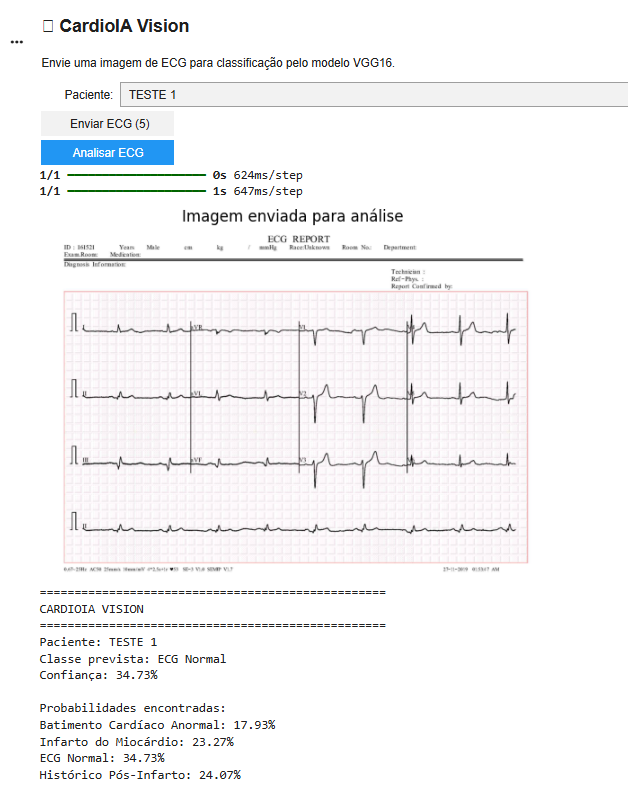

# FIAP - Faculdade de Informática e Administração Paulista

<p align="center">
  <a href="https://www.fiap.com.br/">
    
  </a>
</p>


# CardioIA Vision – Classificação Inteligente de Eletrocardiogramas com Deep Learning

---

## 👨‍🎓 Integrantes

* Vitor Augusto Prado Guisso (RM562317)
* Vinícius Pereira Santana (RM564940)
* Isaac Maciel (RM98222)

---

## 👩‍🏫 Professores

### Tutor(a)

* Caique Nonato da Silva Bezerra

### Coordenador(a)

* Andre Godoi Chiovato

---

# 📜 Descrição

O CardioIA Vision é o módulo de Visão Computacional do ecossistema CardioIA, desenvolvido com o objetivo de investigar a aplicação de técnicas de Deep Learning na classificação automática de imagens de eletrocardiogramas (ECG).

Nesta fase do projeto foram utilizadas Redes Neurais Convolucionais (CNNs) e técnicas de Transfer Learning para identificar padrões presentes em exames cardíacos e classificá-los em diferentes categorias clínicas.

A solução foi construída utilizando um dataset público de imagens médicas e contempla todas as etapas de um pipeline de Visão Computacional:

```txt
Dataset → Pré-processamento → CNN → Transfer Learning → Avaliação → Protótipo
```

Foram avaliadas três abordagens distintas:

* CNN desenvolvida do zero;
* ResNet50 com Fine Tuning;
* VGG16 com Transfer Learning.

Após a comparação dos resultados, a arquitetura VGG16 apresentou o melhor desempenho geral e foi utilizada na construção do protótipo CardioIA Vision.

O sistema permite que o usuário envie uma imagem de eletrocardiograma e receba automaticamente uma classificação produzida pelo modelo treinado.

---
# 📊 Dataset Utilizado

Foi utilizado o dataset público:

## ECG Images Dataset of Cardiac Patients

O conjunto de dados utilizado neste projeto foi obtido a partir da plataforma Kaggle e contém imagens de eletrocardiogramas (ECG) distribuídas em quatro categorias clínicas utilizadas para treinamento e avaliação dos modelos de Deep Learning.

🔗 **Kaggle (fonte original):**  
[Acessar Dataset Utilizado no Kaggle](https://www.kaggle.com/datasets/erhmrai/ecg-image-data)

🔗 **Google Drive (dataset original utilizado no projeto):**  
[Acessar Dataset Utilizado no Drive](https://drive.google.com/drive/folders/1ph4yYmpLv6MYzpFIoFPi8bj2a2t3_Z_5?usp=drive_link)

```txt
928 imagens
```
--- 
## 🔄 Pipeline do Projeto

O CardioIA Vision foi desenvolvido seguindo um pipeline completo de Visão Computacional, desde a obtenção dos dados até a construção do protótipo final.

O fluxo contempla as etapas de preparação das imagens, treinamento de diferentes arquiteturas de Deep Learning, avaliação dos resultados e implementação de uma interface interativa para demonstração da solução.

<p align="center">
  
</p>

### Etapas do Pipeline

| Etapa | Descrição |
|---------|---------|
| 1. Dataset Público | Utilização do dataset ECG Images Dataset of Cardiac Patients. |
| 2. Inspeção dos Dados | Verificação das classes, quantidade de imagens, resolução e formato das imagens. |
| 3. Pré-processamento | Conversão para RGB, redimensionamento para 224x224 pixels e normalização dos pixels. |
| 4. Organização dos Dados | Divisão em conjuntos de treinamento (70%), validação (15%) e teste (15%). |
| 5. Data Augmentation | Aplicação de rotações, zoom e deslocamentos para aumentar a variabilidade dos dados. |
| 6. Treinamento dos Modelos | Implementação de CNN própria, ResNet50 com Fine Tuning e VGG16 com Transfer Learning. |
| 7. Avaliação | Análise utilizando Accuracy, Precision, Recall, F1-Score e Matriz de Confusão. |
| 8. Comparação | Comparação quantitativa entre os modelos desenvolvidos. |
| 9. Seleção do Melhor Modelo | Escolha da VGG16 como arquitetura de melhor desempenho. |
| 10. Protótipo CardioIA Vision | Interface interativa para classificação de exames de ECG. |
| 11. Resultado Interpretável | Exibição da classe prevista e nível de confiança para apoio à tomada de decisão. |

### Resultado Final

Após a comparação das arquiteturas avaliadas, a **VGG16 com Transfer Learning** apresentou o melhor desempenho geral, alcançando aproximadamente **49% de acurácia**, sendo selecionada para compor o protótipo CardioIA Vision.

O protótipo permite que o usuário realize o upload de uma imagem de eletrocardiograma e receba automaticamente uma classificação produzida pelo modelo treinado, demonstrando de forma prática a aplicação de técnicas de Inteligência Artificial na análise de exames médicos.

---

# 📚 Como Navegar pela Documentação

Este repositório foi estruturado para permitir diferentes níveis de aprofundamento no projeto CardioIA Vision.

Dependendo do objetivo do leitor, diferentes materiais podem ser consultados.

---

## 📖 README (Este Documento)

O README foi desenvolvido como uma leitura dinâmica do projeto CardioIA Vision.

Além de cumprir sua função tradicional de documentação inicial para desenvolvedores e avaliadores, este documento centraliza os principais recursos do projeto, servindo como ponto de partida para navegação entre os materiais disponibilizados.

Seu objetivo é apresentar, de forma rápida e organizada, os principais elementos da solução desenvolvida, incluindo:

* Contexto do problema;
* Objetivos do projeto;
* Dataset utilizado;
* Pipeline de Visão Computacional;
* Arquiteturas avaliadas;
* Resultados obtidos;
* Comparação entre modelos;
* Protótipo desenvolvido;
* Principais conclusões.

Também são disponibilizados links para os documentos complementares do projeto, permitindo ao leitor aprofundar sua análise conforme o nível de detalhe desejado.

A leitura deste documento permite compreender a visão geral do CardioIA Vision em poucos minutos, enquanto os relatórios e o notebook fornecem análises técnicas, experimentos, métricas e implementações completas.

Para análises mais detalhadas, recomenda-se consultar os documentos complementares apresentados a seguir.


## 📄 Relatório de Pré-processamento (Parte 1)

Documento elaborado especificamente para atender ao entregável da Parte 1 da atividade.

Conforme solicitado no enunciado, este relatório possui caráter resumido (1 a 2 páginas) e apresenta:

- Descrição do dataset;
- Inspeção inicial das imagens;
- Pré-processamento realizado;
- Divisão dos conjuntos de dados;
- Justificativas das escolhas adotadas.

🔗 **Acessar Relatório de Pré-processamento:**  
- [Relatório de Pré-processamento - Entrega 1](https://github.com/vitorguisso/fiap-2ano/blob/main/FASE%204/document/RELAT%C3%93RIO_PRE-PROCESSAMENTO_FASE4_ENTREGA.pdf)

---

## 📘 Relatório Completo da Fase 4

Documento técnico contendo todo o desenvolvimento do CardioIA Vision.

Neste material são apresentadas análises aprofundadas sobre:

- Fundamentação teórica;
- Dataset utilizado;
- Pipeline completo;
- CNN desenvolvida do zero;
- ResNet50 com Fine Tuning;
- VGG16;
- Métricas de avaliação;
- Matrizes de confusão;
- Curvas de treinamento;
- Comparação entre arquiteturas;
- Desenvolvimento do protótipo;
- Conclusões e trabalhos futuros.

🔗 **Acessar Relatório Completo:**  
- [Relatório Completo da Fase 4](https://github.com/vitorguisso/fiap-2ano/blob/main/FASE%204/document/RELAT%C3%93RIO%20COMPLETO%20-%20FASE4.pdf)

---

## 📓 Notebook Google Colab

O notebook contém a implementação completa do projeto.

Este é o material mais detalhado disponível e permite visualizar todo o processo de desenvolvimento realizado pela equipe.

Nele estão disponíveis:

- Códigos-fonte completos;
- Pré-processamento das imagens;
- Treinamento dos modelos;
- Implementação do Fine Tuning;
- Avaliações e métricas;
- Geração de gráficos;
- Matrizes de confusão;
- Desenvolvimento do protótipo CardioIA Vision;
- Comentários técnicos e análises realizadas durante os experimentos.

🔗 **Abrir Notebook Google Colab:**  

- [Notebook Principal - CardioIA Vision Fase 4](https://github.com/vitorguisso/fiap-2ano/blob/main/FASE%204/notebooks/CardioIA_Vision_Fase4.ipynb)

- [Abrir diretamente no Google Colab](https://colab.research.google.com/github/vitorguisso/fiap-2ano/blob/main/FASE%204/notebooks/CardioIA_Vision_Fase4.ipynb)

---

## 🔍 Guia Rápido

| Se você deseja... | Consulte |
|-------------------|-----------|
| Entender rapidamente o projeto | README |
| Ver apenas o entregável da Parte 1 | Relatório de Pré-processamento |
| Analisar todo o trabalho desenvolvido | Relatório Completo |
| Ver códigos, experimentos e implementação detalhada | Notebook Google Colab |

--- 

# 📁 Estrutura de Pastas

## 📂 assets

Imagens utilizadas na documentação:

* matrizes de confusão;
* métricas
* gráficos;
* protótipo;
* exemplos do dataset;
* logo FIAP.

## 📂 document

Documentação acadêmica:

* relatório entrega parte 1;
* relatório completo da fase 4;

## 📂 notebooks

* CardioIA_Vision_Fase4.ipynb
* CardioIA_Prototype.ipynb

## 📄 README.md

Arquivo principal de documentação do projeto.


---

# 📑 DESENVOLVIMENTO DO PROJETO

---

# 🏥 Objetivo do Projeto

Desenvolver um Assistente Cardiológico Virtual capaz de:

* Processar imagens médicas de eletrocardiogramas;
* Identificar padrões cardíacos por meio de Inteligência Artificial;
* Classificar exames em diferentes categorias clínicas;
* Demonstrar a aplicação prática da Visão Computacional na saúde;
* Disponibilizar um protótipo interativo para análise dos resultados.

---

# 🧠 Arquiteturas Avaliadas

Durante o desenvolvimento foram avaliadas três arquiteturas de Deep Learning.

## 1️⃣ CNN Desenvolvida do Zero

Rede Neural Convolucional construída especificamente para o projeto contendo:

* Camadas convolucionais;
* MaxPooling;
* Flatten;
* Camadas densas;
* Softmax.

---

## 2️⃣ ResNet50 com Fine Tuning

Modelo pré-treinado na base ImageNet utilizando:

* Transfer Learning;
* Fine Tuning das camadas superiores;
* Ajuste para classificação de ECGs.

---

## 3️⃣ VGG16

Modelo pré-treinado na ImageNet utilizado como extrator de características.

Após os experimentos, apresentou o melhor desempenho geral do projeto.

---

## ⚙️ Pré-processamento dos Dados

Antes do treinamento dos modelos de Deep Learning, foi realizada uma etapa completa de preparação e validação do dataset de eletrocardiogramas.

O conjunto de dados utilizado contém 928 imagens reais de ECG distribuídas em quatro categorias clínicas:

- Abnormal Heartbeat;
- Myocardial Infarction;
- Normal ECG;
- Post Myocardial Infarction History.

Durante a inspeção inicial foram verificadas as características do conjunto de dados:

- Total de imagens: 928;
- Número de classes: 4;
- Resolução original: 2213 × 1572 pixels;
- Formato de cor: RGB;
- Imagens corrompidas encontradas: 0.

Após a validação dos dados, foi definido o pipeline de pré-processamento utilizado durante o treinamento dos modelos.

### Etapas aplicadas

#### Redimensionamento

Todas as imagens foram redimensionadas para 224 × 224 pixels, garantindo compatibilidade com as arquiteturas CNN, ResNet50 e VGG16.

#### Normalização

Os valores dos pixels foram normalizados para o intervalo entre 0 e 1 através da divisão por 255, melhorando a estabilidade do treinamento.

#### Data Augmentation

Foram aplicadas técnicas de aumento artificial de dados (Data Augmentation), incluindo:

- Pequenas rotações;
- Zoom;
- Deslocamentos horizontais;
- Deslocamentos verticais.

Essas transformações aumentam a capacidade de generalização dos modelos e ajudam a reduzir problemas de overfitting.

### Divisão do Dataset

Para garantir uma avaliação confiável dos modelos, o conjunto de dados foi dividido em três subconjuntos independentes:

- 70% Treinamento;
- 15% Validação;
- 15% Teste.

O resultado final da divisão é apresentado na figura abaixo.


# 📊 Matrizes de Confusão e Métricas

## CNN Desenvolvida do Zero


A matriz de confusão da CNN desenvolvida do zero evidenciou limitações significativas na capacidade de classificação das imagens de eletrocardiograma.

O modelo apresentou acurácia global de aproximadamente 31%, valor próximo ao esperado em um cenário de classificação aleatória entre quatro classes. A análise da matriz demonstrou que todas as imagens do conjunto de teste foram classificadas como pertencentes à classe normal_ecg_images, independentemente de sua classe real.

Como consequência, as classes:

abnormal_heartbeat_ecg_images;
myocardial_infarction_ecg_images;
post_mi_history_ecg_images;

apresentaram precisão, recall e F1-score iguais a zero.

Por outro lado, a classe normal_ecg_images obteve recall igual a 1,00, indicando que todas as imagens dessa categoria foram corretamente identificadas. Entretanto, esse resultado não representa uma boa capacidade de classificação, pois o modelo passou a prever a mesma classe para todas as amostras avaliadas.

Esse comportamento sugere que a rede neural não conseguiu aprender características discriminantes suficientes para separar adequadamente as quatro categorias presentes no dataset.

Entre os possíveis fatores que contribuíram para esse resultado destacam-se:

Quantidade limitada de imagens disponíveis para treinamento;
Complexidade relativamente baixa da arquitetura proposta;
Dificuldade da CNN em extrair características visuais mais sofisticadas dos eletrocardiogramas;
Similaridade visual entre algumas classes do dataset;
Possível convergência para um mínimo local durante o treinamento.

Os resultados obtidos justificaram a utilização de arquiteturas mais robustas baseadas em Transfer Learning nas etapas seguintes do projeto.

---

## ResNet50 com Fine Tuning


A matriz de confusão da ResNet50 após o Fine Tuning demonstrou que o modelo concentrou grande parte de suas previsões na classe abnormal heartbeat ecg images.

Dos 35 exemplos dessa categoria, 34 foram classificados corretamente, resultando em recall aproximado de 97%. Entretanto, as demais classes apresentaram desempenho muito reduzido, sendo frequentemente classificadas como abnormal heartbeat ecg images.

Esse comportamento evidencia forte viés para uma única classe, prejudicando a capacidade de classificação multiclasse do modelo.

Os resultados observados corroboram a análise das curvas de treinamento, que indicaram sinais de overfitting. Embora o Fine Tuning tenha aumentado a capacidade de aprendizado da arquitetura, a ResNet50 apresentou dificuldade para generalizar adequadamente para imagens não vistas.

Os principais fatores associados a esse comportamento incluem a quantidade limitada de imagens disponíveis, a similaridade visual entre algumas categorias de ECG e a dificuldade de adaptação da arquitetura ao domínio médico.

---

## VGG16


A matriz de confusão da VGG16 confirmou o melhor desempenho geral entre os modelos avaliados.

Dos 35 exames pertencentes à classe abnormal heartbeat ecg images, 32 foram classificados corretamente. Já na classe myocardial infarction ecg images, 33 dos 36 exames foram corretamente identificados.

Esses resultados demonstram que a arquitetura conseguiu reconhecer de forma consistente padrões associados a anormalidades cardíacas e infarto do miocárdio.

Por outro lado, o desempenho foi mais limitado nas classes normal ecg images e post mi history ecg images. Na categoria normal ecg images, apenas 3 dos 43 exames foram classificados corretamente, enquanto a classe post mi history ecg images não apresentou classificações corretas.

Apesar dessas limitações, a VGG16 apresentou melhor equilíbrio entre aprendizado e generalização quando comparada aos demais modelos, alcançando aproximadamente 49% de acurácia no conjunto de teste.

A análise da matriz de confusão reforça os resultados observados nas curvas de treinamento e no relatório de classificação, consolidando a VGG16 como a arquitetura mais adequada para compor o protótipo CardioIA Vision.

---

## Resumo dos Resultados

| Modelo | Acurácia no Teste | Principal Comportamento Observado |
|----------|----------|----------|
| CNN Própria | 31% | Classificou praticamente todas as imagens como normal_ecg_images, apresentando indícios de underfitting. |
| ResNet50 com Fine Tuning | 25% | Demonstrou overfitting e forte viés para a classe abnormal_heartbeat_ecg_images. |
| VGG16 | 49% | Melhor equilíbrio entre aprendizado e generalização, apresentando o melhor desempenho global. |

---


## Comparação Geral das Matrizes de Confusão

A análise conjunta das matrizes de confusão reforça os resultados obtidos ao longo do desenvolvimento do projeto.

A CNN própria apresentou forte limitação na capacidade de diferenciação entre as classes, classificando todas as imagens como normal_ecg_images.

A ResNet50 com Fine Tuning apresentou evolução durante o treinamento, porém concentrou grande parte das previsões em uma única categoria, demonstrando forte viés de classificação e sinais de overfitting.

A VGG16 apresentou a melhor distribuição das previsões entre as classes avaliadas, maior estabilidade durante o treinamento e melhor capacidade de generalização, justificando sua seleção como modelo final do CardioIA Vision.

---

# 📈 Curvas de Treinamento

Com o objetivo de compreender o comportamento dos modelos durante o processo de aprendizado, foram analisadas as curvas de acurácia e perda obtidas ao longo do treinamento.

Como o modelo VGG16 apresentou o melhor desempenho geral entre as arquiteturas avaliadas, suas curvas foram comparadas com as da CNN própria, utilizada como modelo de referência para o projeto.

---

## CNN Própria

### Acurácia e Perda


A análise dos gráficos demonstrou que a acurácia da CNN permaneceu próxima de 30% tanto no treinamento quanto na validação.

Esse resultado indica que o modelo apresentou dificuldade para aprender padrões suficientemente discriminativos entre as quatro classes de eletrocardiogramas.

A função de perda apresentou redução inicial nas primeiras épocas, porém rapidamente se estabilizou. Esse comportamento sugere que a rede atingiu um limite de aprendizado, sem conseguir melhorar significativamente seu desempenho ao longo do treinamento.

Não foram observados sinais claros de overfitting, pois as curvas de treinamento e validação permaneceram relativamente próximas. Entretanto, o desempenho geral foi baixo, indicando um possível caso de underfitting.

Dessa forma, a CNN própria foi importante como linha de base para comparação, mas não conseguiu capturar com eficiência a complexidade visual das imagens de ECG.

---

## VGG16

### Acurácia


### Loss


A análise das curvas de treinamento da VGG16 demonstrou comportamento mais estável em relação aos modelos anteriores.

A acurácia de treinamento apresentou crescimento gradual ao longo das épocas, enquanto a acurácia de validação, apesar de oscilar, manteve tendência geral positiva.


A função de perda também apresentou comportamento positivo, com redução consistente tanto no treinamento quanto na validação.

Esse resultado sugere que a VGG16 conseguiu aproveitar melhor os padrões visuais aprendidos previamente na ImageNet, mesmo em um problema específico de imagens médicas.

A arquitetura apresentou melhor equilíbrio entre aprendizado e generalização, tornando-se a melhor alternativa entre os modelos avaliados.

---

## Comparação entre CNN Própria e VGG16

A comparação das curvas de treinamento reforça os resultados obtidos durante a avaliação dos modelos.

Enquanto a CNN própria apresentou acurácia próxima de 30% e sinais de underfitting, a VGG16 demonstrou crescimento progressivo da acurácia e redução consistente da função de perda.

Além disso, a VGG16 apresentou maior estabilidade entre os conjuntos de treinamento e validação, indicando melhor capacidade de generalização para imagens não vistas.

Esses resultados contribuíram para a escolha da VGG16 como modelo final do CardioIA Vision, uma vez que apresentou o melhor equilíbrio entre aprendizado, estabilidade e desempenho geral.


## Conclusão da Avaliação dos Modelos

A análise conjunta das curvas de treinamento, matrizes de confusão e relatórios de classificação permitiu comparar o comportamento das três arquiteturas avaliadas.

A CNN própria demonstrou limitações na extração de características discriminativas, apresentando desempenho próximo ao de uma classificação aleatória.

A ResNet50 com Fine Tuning apresentou evolução durante o treinamento, porém sofreu com overfitting e forte concentração das previsões em uma única classe.

A VGG16 apresentou o melhor equilíbrio entre aprendizado e capacidade de generalização, alcançando aproximadamente 49% de acurácia no conjunto de teste e apresentando desempenho superior na identificação de exames associados a anormalidades cardíacas e infarto do miocárdio.

Dessa forma, a VGG16 foi selecionada como modelo final do CardioIA Vision, sendo utilizada na construção do protótipo desenvolvido nesta fase do projeto.

---

# 🖥 Protótipo CardioIA Vision

Após a seleção do melhor modelo foi desenvolvido um protótipo interativo utilizando Google Colab.

O sistema permite:

* Informar o nome do paciente;
* Enviar uma imagem de ECG;
* Processar a imagem utilizando o modelo VGG16;
* Exibir a classificação prevista;
* Informar o nível de confiança da predição.

## Exemplo de utilização



⚠️ Importante:

O protótipo possui finalidade acadêmica e demonstrativa. Seu objetivo é apresentar a aplicação prática do modelo desenvolvido, não representar a acurácia real da solução, a qual foi avaliada separadamente por meio das métricas apresentadas no projeto.

---

## Acessar o Protótipo

Clique no botão abaixo para abrir o notebook diretamente no Google Colab:

[](https://colab.research.google.com/github/vitorguisso/fiap-2ano/blob/main/FASE%204/notebooks/CardioIA_Prototype.ipynb) ou 🔗 [Visualizar CardioIA Prototype no GitHub](https://github.com/vitorguisso/fiap-2ano/blob/main/FASE%204/notebooks/CardioIA_Prototype.ipynb)


---

## Como Executar

1. Abra o notebook no Google Colab.
2. Execute todas as células.
3. Aguarde o download automático do modelo VGG16.
4. Informe o nome do paciente.
5. Faça upload de uma imagem de eletrocardiograma (.png, .jpg ou .jpeg).
6. Clique em **Analisar ECG**.
7. Visualize o resultado da classificação.

---

## Funcionalidades

- Download automático do modelo VGG16 via Google Drive;
- Upload de imagens ECG;
- Pré-processamento automático da imagem;
- Classificação em quatro categorias cardíacas;
- Exibição da classe prevista;
- Exibição da confiança da predição;
- Exibição das probabilidades para todas as classes.

---

## Classes Avaliadas

- Batimento Cardíaco Anormal
- Infarto do Miocárdio
- ECG Normal
- Histórico Pós-Infarto

---

# 🚀 Tecnologias Utilizadas no projeto

## Inteligência Artificial

* TensorFlow
* Keras
* NumPy
* Scikit-Learn

## Visão Computacional

* OpenCV
* PIL
* Matplotlib

## Ambiente

* Google Colab
* Python 3

---

# 🧠 Conceitos Aplicados

* Visão Computacional
* Deep Learning
* Redes Neurais Convolucionais
* Transfer Learning
* Fine Tuning
* Classificação de Imagens
* Inteligência Artificial aplicada à Saúde
* Avaliação de Modelos
* Machine Learning

---

# 📊 Funcionalidades Implementadas

## ✅ Pré-processamento

* Redimensionamento;
* Normalização;
* Organização dos dados;
* Divisão treino/validação/teste.

## ✅ CNN Desenvolvida do Zero

* Construção da arquitetura;
* Treinamento;
* Avaliação.

## ✅ Transfer Learning

* ResNet50;
* VGG16.

## ✅ Avaliação

* Accuracy;
* Precision;
* Recall;
* F1-score;
* Matriz de confusão.

## ✅ Protótipo

* Upload de ECG;
* Nome do paciente;
* Classificação automática;
* Nível de confiança.

---

# 🏁 Conclusão

Este projeto teve como objetivo investigar a aplicação de técnicas de Visão Computacional e Deep Learning na classificação automática de eletrocardiogramas (ECG), utilizando imagens pertencentes a quatro categorias distintas: batimentos cardíacos anormais, infarto do miocárdio, exames normais e histórico pós-infarto.

Inicialmente, foi desenvolvida uma Rede Neural Convolucional (CNN) própria, construída do zero, com o objetivo de estabelecer uma linha de base para comparação. Em seguida, foram avaliadas arquiteturas amplamente utilizadas na literatura por meio da estratégia de Transfer Learning, utilizando os modelos ResNet50 e VGG16 pré-treinados na base ImageNet.

Durante o desenvolvimento do projeto foram realizadas as etapas de inspeção do dataset, pré-processamento das imagens, normalização, redimensionamento, divisão em conjuntos de treinamento, validação e teste, além da aplicação de técnicas de Data Augmentation para aumentar a capacidade de generalização dos modelos.

Os resultados demonstraram que a CNN própria apresentou desempenho limitado, concentrando suas previsões em uma única classe e evidenciando dificuldade para aprender representações discriminativas adequadas do conjunto de dados. A ResNet50, mesmo após a aplicação de Fine Tuning, apresentou evolução durante o treinamento, porém manteve baixa capacidade de generalização, resultando em desempenho inferior ao esperado no conjunto de teste.

Entre os modelos avaliados, o VGG16 apresentou os melhores resultados gerais, alcançando aproximadamente 49% de acurácia no conjunto de teste e demonstrando elevada capacidade de identificação das classes relacionadas a anormalidades cardíacas e infarto do miocárdio. A análise das curvas de treinamento indicou comportamento estável, com redução consistente da função de perda e ausência de sinais evidentes de overfitting. A matriz de confusão confirmou que o modelo foi capaz de identificar corretamente a maior parte dos exames dessas categorias, embora ainda tenha apresentado dificuldades na diferenciação das classes normal e histórico pós-infarto.

Além do desenvolvimento e avaliação dos modelos, foi criado um protótipo interativo capaz de receber imagens de eletrocardiogramas e apresentar automaticamente a classificação prevista pelo modelo selecionado. Esse protótipo demonstra, de forma prática, como técnicas de Inteligência Artificial podem ser incorporadas a sistemas de apoio à decisão clínica.

Os resultados obtidos demonstram que a utilização de arquiteturas pré-treinadas constitui uma alternativa promissora para problemas de classificação de imagens médicas, especialmente em cenários onde a quantidade de dados disponíveis é limitada. Ao mesmo tempo, evidenciam os desafios inerentes à análise de eletrocardiogramas, cujas classes frequentemente apresentam características visuais semelhantes.

Como trabalhos futuros, recomenda-se a ampliação do conjunto de dados, a aplicação de técnicas mais avançadas de Data Augmentation, o balanceamento das classes, a realização de Fine Tuning mais aprofundado nas camadas convolucionais da VGG16 e a avaliação de arquiteturas mais modernas, como EfficientNet, DenseNet e Vision Transformers. Também podem ser exploradas abordagens híbridas que combinem análise de imagens e processamento de sinais cardíacos para aumentar a capacidade de discriminação dos modelos.

Dessa forma, conclui-se que os objetivos propostos para a Fase 4 foram alcançados. O projeto permitiu construir, treinar, comparar e avaliar diferentes arquiteturas de Deep Learning aplicadas à classificação de eletrocardiogramas, além de disponibilizar um protótipo funcional para demonstração dos resultados. O estudo também contribuiu para a compreensão dos benefícios, limitações e desafios envolvidos na aplicação da Inteligência Artificial ao contexto da saúde, reforçando o potencial dessas tecnologias como ferramentas de apoio ao diagnóstico médico.

---

# 📚 Referências

- GOODFELLOW, Ian; BENGIO, Yoshua; COURVILLE, Aaron. *Deep Learning*. Cambridge: MIT Press, 2016.
- HE, Kaiming; ZHANG, Xiangyu; REN, Shaoqing; SUN, Jian. *Deep Residual Learning for Image Recognition*. In: IEEE Conference on Computer Vision and Pattern Recognition (CVPR), 2016.
- SIMONYAN, Karen; ZISSERMAN, Andrew. *Very Deep Convolutional Networks for Large-Scale Image Recognition*. arXiv preprint arXiv:1409.1556, 2015.
- SHORTEN, Connor; KHOSHGOFTAAR, Taghi M. *A Survey on Image Data Augmentation for Deep Learning*. Journal of Big Data, v. 6, n. 60, 2019.
- TENSORFLOW. *TensorFlow Documentation*. Disponível em: <https://www.tensorflow.org/>. Acesso em: 16 jun. 2026.
- KAGGLE. *ECG Images Dataset*. Kaggle, [s.d.]. Disponível em: <https://www.kaggle.com/datasets/erhmrai/ecg-image-data>. Acesso em: 16 jun. 2026.
  
---

# 📋 Licença


Este projeto está licenciado sob Creative Commons Attribution 4.0 International.


