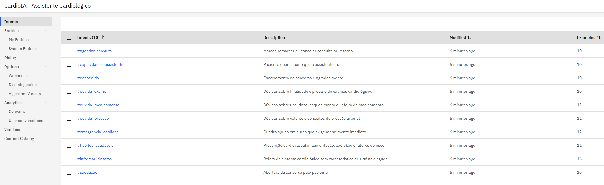
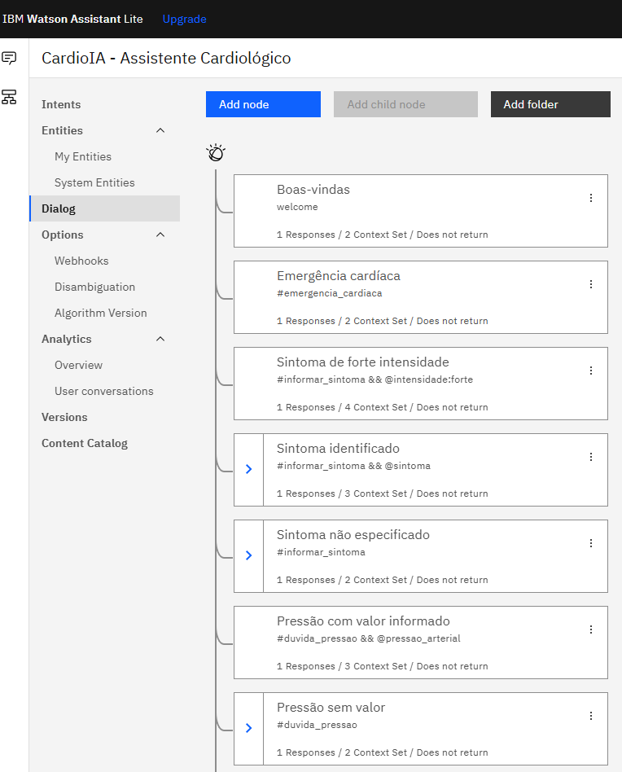
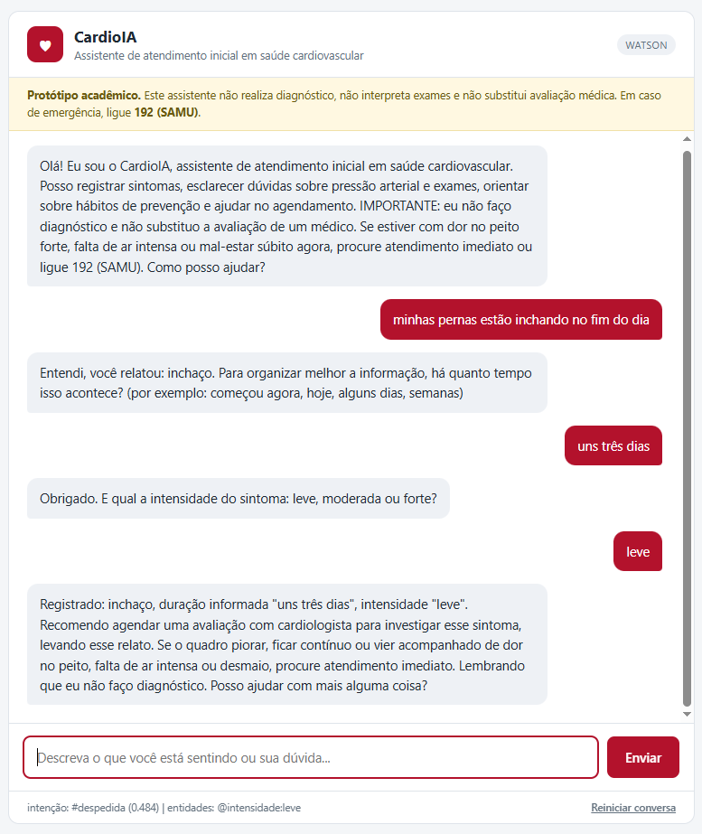
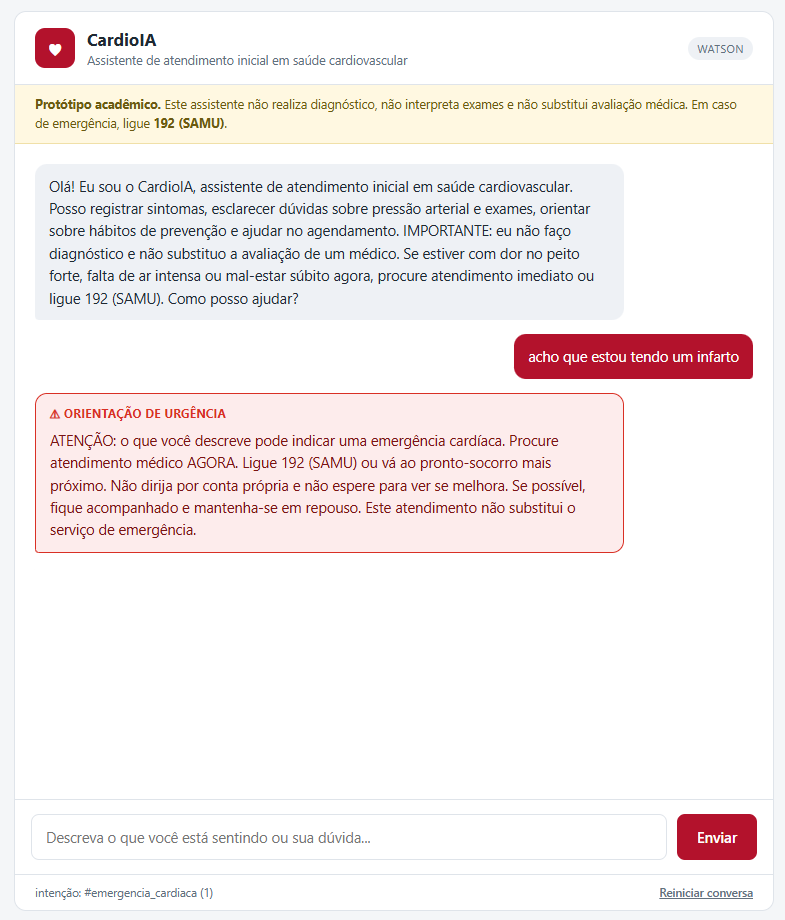

# FIAP - Faculdade de Informática e Administração Paulista

<p align="center">
  <a href="https://www.fiap.com.br/">
    
  </a>
</p>


# CardioIA Assistente – Assistente Cardiológico Inteligente e Conversacional com NLP

---

## 👨‍🎓 Integrantes

* Vitor Augusto Prado Guisso (RM562317)
* Vinícius Pereira Santana (RM564940)
* Isaac Maciel (RM98222)

---

## 👩‍🏫 Professores

### Tutor(a)

* Caique Nonato da Silva Bezerra

### Coordenador(a)

* Andre Godoi Chiovato

---

# 📜 Descrição

O **CardioIA Assistente** é o módulo conversacional do ecossistema CardioIA, desenvolvido com o objetivo de investigar a aplicação de técnicas de Processamento de Linguagem Natural na construção de agentes virtuais aplicados à saúde.

Após as fases dedicadas ao monitoramento de dados, à análise de imagens médicas e à prototipação visual, esta fase desloca o foco para a **comunicação inteligente entre sistema e paciente**.

A solução foi construída sobre a plataforma **IBM Watson Assistant**, conforme apresentado na disciplina de Processamento de Linguagem Natural, Chatbots & Virtual Agents, e contempla todas as etapas de um pipeline conversacional:

```txt
Intenções → Entidades → Árvore de Diálogo → API → Backend Flask → Interface Web
```

O assistente realiza **triagem informativa** em contexto cardiológico: reconhece a intenção do paciente em linguagem natural, extrai informação clínica estruturada, identifica sinais de urgência e direciona ao canal correto de atendimento.

Foram implementados dois motores de compreensão de linguagem:

* **IBM Watson Assistant** — motor principal, atendendo ao requisito da atividade;
* **Motor de NLU local** — modo de demonstração que interpreta a mesma skill exportada, garantindo que o projeto seja executável por qualquer avaliador sem acesso às credenciais privadas da IBM Cloud.

> ⚠️ **Importante**
>
> O assistente possui finalidade acadêmica e demonstrativa. Ele **não realiza diagnóstico**, não interpreta laudos de exames, não prescreve nem ajusta medicamentos e não substitui a avaliação de um profissional de saúde. Em situações de emergência, o serviço correto é o **192 (SAMU)**.
>
> Essa fronteira não é apenas um aviso na interface: ela está implementada na própria árvore de diálogo.

---

# 🏗 Arquitetura da Solução

A aplicação segue a arquitetura demonstrada no material didático da disciplina: uma interface web que consome, via `fetch`, uma rota de um servidor Flask, que por sua vez se comunica com o serviço de NLU na nuvem através do SDK oficial.

```txt
┌──────────────────────────────────────┐
│  Navegador                           │
│  templates/index.html                │
│  interface de chat + fetch()          │
└───────────────┬──────────────────────┘
                │ POST /api/chat  {"message": "..."}
                v
┌──────────────────────────────────────┐
│  Backend Flask — src/backend/app.py  │
│                                      │
│  ┌────────────────────────────────┐  │
│  │ watson_client.py               │  │      ┌─────────────────────────┐
│  │ AssistantV2 + IAMAuthenticator │──┼─────▶│  IBM watsonx Assistant  │
│  │ sessão reaproveitada           │  │      │  intents · entities     │
│  └────────────────────────────────┘  │      │  dialog nodes · contexto│
│                 ou                   │      └─────────────────────────┘
│  ┌────────────────────────────────┐  │
│  │ nlu_local.py                   │  │      ┌─────────────────────────┐
│  │ NLU local (IDF + radical)      │──┼─────▶│ skill-cardioia-         │
│  │ modo de demonstração           │  │      │ dialog.json             │
│  └────────────────────────────────┘  │      └─────────────────────────┘
│                                      │
│  ┌────────────────────────────────┐  │
│  │ triagem.py                     │  │
│  │ regra de faixa de pressão      │  │
│  └────────────────────────────────┘  │
└──────────────────────────────────────┘
```

### Divisão de responsabilidade

| Componente | Responsabilidade |
|------------|------------------|
| Watson Assistant | Compreensão da linguagem: identifica a intenção e extrai as entidades |
| `triagem.py` | Regra de domínio aplicada sobre o valor extraído (faixa de pressão arterial) |
| `app.py` | Orquestração, gestão de sessão e tratamento de falhas |
| `index.html` | Apresentação e interação com o paciente |

A entidade `@pressao_arterial` é uma expressão regular: ela reconhece o formato `150/100`, mas não sabe se o valor é plausível nem em que faixa clínica ele se enquadra. Manter a regra de faixa fora da árvore de diálogo deixa a lógica isolada e testável, evitando criar um nó de diálogo por faixa.

Os dois motores de NLU devolvem **o mesmo contrato de dados**, de modo que nem o `app.py` nem a interface precisam saber qual deles está respondendo.

---

# 📚 Como Navegar pela Documentação

Este repositório foi estruturado para permitir diferentes níveis de aprofundamento no projeto CardioIA Assistente.

Dependendo do objetivo do leitor, diferentes materiais podem ser consultados.

---

## 📖 README (Este Documento)

O README foi desenvolvido como uma leitura dinâmica do projeto CardioIA Assistente.

Além de cumprir sua função tradicional de documentação inicial para desenvolvedores e avaliadores, este documento centraliza os principais recursos do projeto, servindo como ponto de partida para navegação entre os materiais disponibilizados.

Seu objetivo é apresentar, de forma rápida e organizada, os principais elementos da solução desenvolvida, incluindo:

* Contexto do problema;
* Objetivos do projeto;
* Arquitetura da solução;
* Modelagem do assistente conversacional;
* Integração entre backend e serviço de NLU;
* Interface de interação;
* Resultados dos testes executados;
* Dificuldades enfrentadas;
* Limitações e trabalhos futuros;
* Principais conclusões.

A leitura deste documento permite compreender a visão geral do CardioIA Assistente em poucos minutos, enquanto os documentos complementares fornecem o projeto detalhado do fluxo, as decisões técnicas e os registros de teste.

---

## 📄 Relatório do Fluxo Conversacional (Entregável da Parte 1)

Documento elaborado especificamente para atender ao entregável da Parte 1 da atividade.

Conforme solicitado no enunciado, este relatório possui caráter resumido (1 a 2 páginas) e apresenta o funcionamento do fluxo conversacional:

- Escopo e papel do assistente;
- Intenções e entidades modeladas;
- Estrutura da árvore de diálogo;
- Tratamento de exceções;
- Justificativas das escolhas adotadas.

🔗 **Acessar Relatório do Fluxo Conversacional:**
- [Relatório do Fluxo Conversacional — PDF](document/RELATORIO_FLUXO_CONVERSACIONAL_FASE5.pdf)
- [Versão em Markdown](document/RELATORIO_FLUXO_CONVERSACIONAL_FASE5.md) (fonte do PDF)

O PDF é gerado a partir do Markdown por `scripts/gerar_relatorio_pdf.py`, o que permite
manter o conteúdo versionado e regerar o documento sempre que ele for revisado.

---

## 📘 Documento Técnico do Fluxo Conversacional

Documento técnico contendo todo o projeto do assistente.

Neste material são apresentadas análises aprofundadas sobre:

- Escopo, persona e limites éticos;
- As 10 intenções e o raciocínio por trás da separação entre elas;
- As 6 entidades, incluindo a entidade por expressão regular;
- Variáveis de contexto e diálogo de múltiplas etapas;
- Árvore de diálogo completa e a lógica de ordenação dos nós;
- Decisões técnicas e alternativas consideradas;
- Plano de testes e resultados obtidos;
- Dificuldades encontradas, com causa, solução e resultado;
- Limitações conhecidas.

🔗 **Acessar Documento Técnico:**
- [Projeto do Fluxo Conversacional](document/FLUXO_CONVERSACIONAL.md)

---

## 🧩 Skill Exportada do Watson Assistant

Arquivo de configuração do assistente, no formato de exportação do Watson Assistant.

Este é o entregável que materializa a modelagem conversacional e pode ser **importado diretamente** em uma instância do Watson Assistant, sem necessidade de recriar manualmente as intenções, entidades e nós de diálogo.

🔗 **Acessar Skill:**
- [skill-cardioia-dialog.json](config/watson/skill-cardioia-dialog.json)

---

## 🎥 Vídeo de Demonstração

Vídeo curto (até 3 minutos) demonstrando o funcionamento da interação entre usuário e assistente: triagem de sintoma em múltiplas etapas, reconhecimento de urgência, captura da medida de pressão arterial e tratamento de perguntas fora do escopo.

O roteiro utilizado na gravação, com os blocos demonstrados e o tempo previsto de cada um, está disponível em [document/ROTEIRO_VIDEO.md](document/ROTEIRO_VIDEO.md).

🔗 **Acessar Vídeo:**

<!-- ┌──────────────────────────────────────────────────────────────────────┐
     │  SUBSTITUA A LINHA ABAIXO PELO LINK DO VÍDEO                         │
     │                                                                      │
     │  Deixe exatamente neste formato:                                     │
     │  - [Vídeo de demonstração - CardioIA Fase 5](COLE_O_LINK_AQUI)       │
     │                                                                      │
     │  Antes de publicar, confirme que o link abre em janela anônima.      │
     └──────────────────────────────────────────────────────────────────────┘ -->

- Vídeo de demonstração — *link a ser inserido*

---

## 🔍 Guia Rápido

| Se você deseja... | Consulte |
|-------------------|-----------|
| Entender rapidamente o projeto | README |
| Ver apenas o entregável da Parte 1 | Relatório do Fluxo Conversacional |
| Analisar o projeto completo do assistente | Documento Técnico do Fluxo Conversacional |
| Importar o assistente no Watson | Skill Exportada (`config/watson/`) |
| Ver o código do backend e da integração | `src/backend/` |
| Ver a demonstração funcionando | Vídeo de Demonstração |
| Regravar ou conferir o roteiro da demonstração | `document/ROTEIRO_VIDEO.md` |

---

# 📁 Estrutura de Pastas

## 📂 assets

Imagens utilizadas na documentação:

* capturas da modelagem no Watson Assistant;
* capturas da interface em funcionamento;
* evidências dos testes executados;
* logo FIAP.

## 📂 config

Arquivos de configuração e exportação:

* `watson/skill-cardioia-dialog.json` — skill exportável e importável no Watson Assistant.

## 📂 document

Documentação acadêmica:

* `RELATORIO_FLUXO_CONVERSACIONAL_FASE5.pdf` — relatório da entrega da Parte 1;
* `RELATORIO_FLUXO_CONVERSACIONAL_FASE5.md` — fonte do relatório;
* `FLUXO_CONVERSACIONAL.md` — documento técnico completo do fluxo, com as decisões, os testes e as 11 dificuldades registradas;
* `ROTEIRO_VIDEO.md` — roteiro da gravação da demonstração.

## 📂 scripts

Scripts auxiliares:

* `testar_nlu_local.py` — execução do plano de testes do fluxo conversacional;
* `gerar_relatorio_pdf.py` — geração do PDF do relatório a partir do Markdown;
* `auditar_entrega.py` — verificação de consistência da entrega;
* `preparar_entrega.py` — montagem da pasta de entrega, sem credenciais nem material pessoal.

## 📂 src

Código-fonte da aplicação:

* `backend/app.py` — servidor Flask e rotas da API;
* `backend/watson_client.py` — cliente do IBM Watson Assistant;
* `backend/nlu_local.py` — motor de NLU do modo de demonstração;
* `backend/triagem.py` — regra de faixa de pressão arterial;
* `backend/templates/index.html` — interface de interação com o usuário;
* `backend/.env.example` — exemplo de configuração de credenciais;
* `backend/requirements.txt` — dependências do projeto.

## 📄 README.md

Arquivo principal de documentação do projeto.

---

# 📑 DESENVOLVIMENTO DO PROJETO

---

# 🏥 Objetivo do Projeto

Desenvolver um Assistente Cardiológico Conversacional capaz de:

* Interagir com o paciente por meio de linguagem natural;
* Simular um atendimento inicial em saúde cardiovascular;
* Integrar serviços de NLP conforme apresentado nas aulas;
* Organizar e apresentar informações clínicas de forma estruturada e compreensível;
* Identificar sinais de urgência e orientar o encaminhamento adequado;
* Disponibilizar uma interface simples para interação com o usuário;
* Respeitar os limites técnicos, éticos e conceituais discutidos ao longo da fase.

---

# 🧠 Modelagem do Assistente Conversacional

## Intenções (Intents)

Foram modeladas **10 intenções**, totalizando **111 exemplos de treino** em português brasileiro.

| Intenção | O que captura |
|----------|---------------|
| `saudacao` | Abertura da conversa |
| `despedida` | Encerramento e agradecimento |
| `capacidades_assistente` | O que o assistente faz e o que não faz |
| `emergencia_cardiaca` | Quadro agudo em curso |
| `informar_sintoma` | Relato de sintoma sem característica de urgência aguda |
| `duvida_pressao` | Valores e conceitos de pressão arterial |
| `duvida_medicamento` | Dose, esquecimento e efeito colateral |
| `duvida_exame` | Finalidade e preparo de exames cardiológicos |
| `agendar_consulta` | Marcar, remarcar ou cancelar consulta |
| `habitos_saudaveis` | Prevenção cardiovascular e fatores de risco |

### Decisão técnica: separar emergência de relato de sintoma

O par de intenções mais delicado do projeto é `emergencia_cardiaca` × `informar_sintoma`. As frases *"estou com dor no peito"* e *"estou com dor no peito forte agora e não consigo respirar"* são linguisticamente próximas, mas clinicamente opostas em urgência.

Duas alternativas foram consideradas:

* **Uma única intenção**, com a urgência decidida posteriormente pela entidade `@intensidade`. Mais simples, porém a identificação da urgência passaria a depender de o paciente utilizar uma palavra específica da lista de sinônimos.
* **Duas intenções distintas**, com `emergencia_cardiaca` treinada especificamente em frases de quadro agudo e avaliada antes na árvore de diálogo.

Foi adotada a segunda alternativa. O custo é maior esforço de curadoria dos exemplos de treino e risco de falso positivo, no qual o assistente orienta procurar emergência sem que isso fosse necessário. Em triagem em saúde, esse é o erro preferível: um falso positivo gera deslocamento desnecessário, enquanto um falso negativo pode atrasar o atendimento de um infarto. A assimetria entre as consequências justifica a escolha.

## Entidades (Entities)

Foram modeladas **6 entidades customizadas**.

| Entidade | Tipo | Finalidade |
|----------|------|------------|
| `@sintoma` | Sinônimos | Identifica o sintoma relatado (8 valores) |
| `@intensidade` | Sinônimos | Modula a resposta e reforça a urgência |
| `@duracao` | Sinônimos | Contextualiza o relato temporalmente |
| `@pressao_arterial` | **Expressão regular** | Captura a medida informada em qualquer formato |
| `@exame` | Sinônimos | Seleciona a explicação do exame (6 valores) |
| `@fator_risco` | Sinônimos | Direciona a orientação de prevenção (7 valores) |

### Decisão técnica: pressão arterial como entidade de regex

Pressão arterial é o caso adequado para uma entidade baseada em expressão regular, técnica demonstrada no material didático. O paciente escreve a medida de formas imprevisíveis — `150/100`, `150 por 100`, `15 x 10`, `12x8` — e nenhuma lista de sinônimos cobriria essa variação.

A alternativa tecnicamente possível seria capturar dois valores numéricos com a entidade de sistema `@sys-number` e reconstruir o par no backend. Essa opção foi descartada porque perde a associação entre os números, tornando impossível determinar qual deles representa a pressão sistólica.

## Árvore de Diálogo

A árvore possui **29 nós**. A ordem dos nós é parte da lógica: o Watson Assistant avalia as condições de cima para baixo e responde pelo primeiro nó cuja condição é verdadeira.

```txt
[1]  Boas-vindas                    welcome
[2]  Emergência cardíaca            #emergencia_cardiaca
[3]  Sintoma de forte intensidade   #informar_sintoma && @intensidade:forte
[4]  Sintoma identificado           #informar_sintoma && @sintoma
       └─ coleta de duração → coleta de intensidade → resumo estruturado
[5]  Sintoma não especificado       #informar_sintoma
       └─ captura do sintoma → salto para [4]
[6]  Pressão com valor              #duvida_pressao && @pressao_arterial
[7]  Pressão sem valor              #duvida_pressao
       └─ captura da medida → salto para [6]
[8]  Dúvida de medicamento          #duvida_medicamento
[9]  Exames (6 nós por tipo)        #duvida_exame && @exame:<valor>
[15] Exame não especificado         #duvida_exame
[16] Agendar consulta               #agendar_consulta
[17] Hábitos com fator de risco     #habitos_saudaveis && @fator_risco
[18] Hábitos - orientação geral     #habitos_saudaveis
[19] Capacidades do assistente      #capacidades_assistente
[20] Saudação                       #saudacao
[21] Despedida                      #despedida
[22] Escalonamento de falha         anything_else && $falhas > 0
[23] Não entendi                    anything_else
```

### Decisão de segurança: o nó de emergência vem primeiro

Se `#informar_sintoma` fosse avaliado antes, um paciente em quadro agudo entraria no fluxo de coleta de dados — *"há quanto tempo?"*, *"é leve ou forte?"* — antes de receber qualquer orientação. Em triagem, isso é inaceitável. A posição do nó na árvore é, portanto, uma decisão de segurança, e não de estilo.

### Decisão técnica: o nó de medicamento responde "não"

É contraintuitivo projetar um nó cuja função é não responder à pergunta feita. Entretanto, orientar dose de medicamento cardiovascular extrapola o papel de um assistente virtual e contraria os limites éticos exigidos pela atividade.

O nó reconhece a intenção — o paciente é atendido, e não ignorado —, explica por que não pode responder e indica o canal correto. Reconhecer e recusar é uma experiência melhor do que deixar a mensagem cair no tratamento de exceção.

### Decisão técnica: nós filhos em vez de slots

O Watson Assistant clássico oferece o recurso de **slots** para coleta de múltiplas informações. Optou-se por **nós filhos com variáveis de contexto**.

O comportamento padrão de um nó com filhos — aguardar a entrada do usuário e avaliar os filhos antes de retornar à raiz — já entrega a coleta em etapas, e a estrutura resultante é significativamente mais legível na árvore de diálogo para quem for avaliar o trabalho.

A limitação aceita é que a ordem de coleta passa a ser fixa: sintoma, depois duração, depois intensidade. Para uma triagem inicial guiada, ordem fixa é adequada.

## Variáveis de Contexto

| Variável | Função |
|----------|--------|
| `$sintoma_relatado` | Mantém o sintoma entre turnos da conversa |
| `$duracao` | Armazena a duração informada |
| `$intensidade` | Compõe a orientação final |
| `$urgencia` | Marca a conversa como caso de urgência |
| `$falhas` | Contador que dispara o escalonamento do tratamento de exceção |

As variáveis de contexto são o que permite à conversa ter memória entre turnos. Sem elas, cada mensagem seria tratada como um atendimento novo.

## Tratamento de Exceções

O enunciado solicita tratamento básico de exceções. Foram implementadas três camadas:

1. **`anything_else` com escalonamento** — o contador `$falhas` evita que o assistente repita indefinidamente a mesma resposta de não compreensão. Na segunda falha, ele reconhece o próprio limite e oferece encaminhamento humano.
2. **Repergunta nos fluxos de coleta** — quando o paciente não fornece a informação solicitada, o assistente pergunta novamente de forma orientada.
3. **Falha de infraestrutura no backend** — indisponibilidade ou credencial inválida do serviço retornam mensagem amigável ao usuário, sem exposição de rastreamento de erro na interface.

A terceira camada não pertence ao Watson Assistant, mas ao servidor Flask.

---

# 🔌 Integração entre Backend e Assistente

A integração utiliza o SDK oficial `ibm-watson`, com `AssistantV2` e `IAMAuthenticator`, conforme a arquitetura apresentada no material didático.

| Rota | Método | Função |
|------|--------|--------|
| `/` | GET | Entrega a interface de chat |
| `/api/iniciar` | POST | Abre a conversa e retorna a saudação |
| `/api/chat` | POST | Envia a mensagem e retorna a resposta do assistente |
| `/api/reset` | POST | Encerra a conversa atual |
| `/api/health` | GET | Informa o estado do serviço e o motor em uso |

## Decisão técnica: reaproveitamento da sessão

O exemplo de integração apresentado no material didático cria uma nova sessão a cada mensagem recebida. Essa abordagem tem uma consequência relevante: como as variáveis de contexto pertencem à sessão, elas são descartadas a cada turno.

Na prática, isso inviabilizaria todo o fluxo de coleta em múltiplas etapas projetado na árvore de diálogo — o assistente perguntaria a duração do sintoma e, na mensagem seguinte, já teria esquecido qual era o sintoma.

Nesta implementação, a sessão é criada uma vez e reaproveitada ao longo da conversa. Sessões do Watson Assistant expiram por inatividade; quando isso ocorre, a API responde com código 404 e o cliente recria a sessão de forma transparente, sem que o usuário perceba a falha.

Essa divergência em relação ao material didático foi deliberada e está registrada como decisão técnica.

## Segurança das credenciais

As credenciais da IBM Cloud são lidas de variáveis de ambiente, a partir de um arquivo `.env` que **não é versionado**. O repositório contém apenas o `.env.example`, com a descrição de onde obter cada valor.

---

# 🖥 Interface de Interação

A interface foi construída em HTML, CSS e JavaScript, consumindo a rota `/api/chat` do servidor Flask por meio de `fetch`, conforme o exemplo apresentado no material didático.

A escolha por manter a interface em arquivo único, sem dependências externas, foi deliberada: o avaliador precisa apenas do Flask em execução, sem instalação de Node.js, processo de build ou acesso a CDN.

## Funcionalidades da interface

* Envio de mensagens e visualização das respostas do assistente;
* **Destaque visual de urgência** — respostas de emergência recebem tratamento visual diferenciado, com borda e rótulo de alerta;
* **Aviso clínico permanente** no topo da tela;
* **Rodapé técnico de depuração** — exibe a intenção reconhecida, o grau de confiança, as entidades extraídas e a classificação da pressão arterial, evidenciando o resultado do NLU durante a demonstração;
* Indicador do motor em uso (`WATSON` ou `LOCAL`);
* Botão de reinício da conversa;
* Tratamento de falha de conexão com o servidor;
* Layout responsivo.

---

# 🧪 Testes e Resultados

## Plano de testes executado — motor de NLU local

Execução: `python scripts/testar_nlu_local.py`

**Resultado: 17 de 17 casos conforme o esperado.**

| # | Cenário | Entrada | Resultado obtido | Status |
|---|---------|---------|------------------|--------|
| T01 | Saudação | "oi" | `#saudacao` | ✅ |
| T02 | Emergência explícita | "acho que estou tendo um infarto" | `#emergencia_cardiaca`, urgência | ✅ |
| T03 | Emergência implícita | "meu peito está apertado e o braço esquerdo formigando" | `#emergencia_cardiaca`, urgência | ✅ |
| T04 | Sintoma leve | "sinto o coração acelerado às vezes" | `#informar_sintoma`, `@sintoma:palpitacao` | ✅ |
| T05 | Dor torácica intensa | "estou com dor no peito muito forte" | `#emergencia_cardiaca`, urgência | ✅ |
| T05b | Sintoma não torácico forte | "meu cansaço está forte" | Nó de sintoma forte, urgência | ✅ |
| T05c | Ambiguidade de tontura forte | "minha tontura está muito forte" | `#emergencia_cardiaca` (direção segura) | ✅ |
| T06 | Pressão com barra | "minha pressão deu 150/100" | `@pressao_arterial` capturada | ✅ |
| T07 | Pressão em texto | "medi 12 por 8" | `@pressao_arterial` capturada | ✅ |
| T08 | Medicamento | "posso parar de tomar losartana" | Recusa e encaminhamento | ✅ |
| T09 | Exame | "o que é holter" | Nó do exame correspondente | ✅ |
| T10 | Fora de escopo | "qual a previsão do tempo" | Tratamento de exceção, 1ª falha | ✅ |
| T11 | Fora de escopo repetido | Duas mensagens fora do escopo | Escalonamento | ✅ |
| T14 a T17 | Agendamento, hábitos, capacidades, despedida | — | Nó correspondente | ✅ |

## Diálogos de múltiplos turnos verificados na interface

| # | Diálogo | Resultado obtido | Status |
|---|---------|------------------|--------|
| D01 | Sintoma → duração → intensidade | Contexto preservado, resumo final correto | ✅ |
| D02 | Sintoma informado apenas no segundo turno | Salto para o nó principal executado | ✅ |
| D03 | Emergência no meio da coleta de dados | Coleta interrompida, urgência orientada | ✅ |
| D04 | Pressão informada apenas no segundo turno | Salto para o nó de faixas executado | ✅ |
| D05 | Agendamento → preferência de período | Preferência registrada | ✅ |

## Regra de classificação da pressão arterial

| Entrada | Valor normalizado | Classificação | Urgência |
|---------|-------------------|---------------|----------|
| 110/70 | 110/70 mmHg | Ótima | Não |
| 128/84 | 128/84 mmHg | Normal | Não |
| 135/88 | 135/88 mmHg | Pré-hipertensão | Não |
| 150/100 | 150/100 mmHg | Hipertensão (a confirmar) | Não |
| 190/120 | 190/120 mmHg | Muito elevada | **Sim** |
| "12 por 8" | 120/80 mmHg | Normal | Não |
| "15x10" | 150/100 mmHg | Hipertensão (a confirmar) | Não |
| 999/999 | — | Valor implausível | Não |
| "não medi a pressão" | — | Nenhuma medida reconhecida | — |

## Testes executados no IBM Watson Assistant

Instância criada em 13/08/2026: watsonx Assistant, plano Lite, Dallas (us-south), experiência clássica. A plataforma confirma o conteúdo importado: **10 Intents · 6 Entities · 29 Dialog nodes**, idioma Brazilian Portuguese.

Casos executados com o backend em modo `watson`, integrado à nuvem:

| # | Entrada | Intenção (confiança) | Entidades | Urgência |
|---|---------|----------------------|-----------|----------|
| T02 | "acho que estou tendo um infarto" | `emergencia_cardiaca` (1,00) | — | **sim** |
| D01a | "minhas pernas estão inchando no fim do dia" | `informar_sintoma` (1,00) | `@sintoma:inchaço` | não |
| D01b | "uns três dias" | — | `@duracao:dias` | não |
| D01c | "leve" | `despedida` (0,48) | `@intensidade:leve` | não |
| T07 | "medi 190 por 120" | `duvida_pressao` (0,81) | `@pressao_arterial` | **sim** |
| T08 | "posso parar de tomar losartana" | `duvida_medicamento` (1,00) | — | não |
| T09 | "o que é holter" | `duvida_exame` (1,00) | `@exame:holter` | não |
| T10 | "qual a previsão do tempo" | — | — | não |

O caso D01c é instrutivo: o classificador atribuiu `#despedida` à palavra "leve", com confiança baixa (0,48), mas o nó filho de coleta foi avaliado antes e tratou a mensagem corretamente. É um exemplo prático de por que a estrutura da árvore de diálogo não deve depender apenas da classificação de intenção.

## Tratamento de exceções — testes executados

| # | Cenário | Resultado obtido | Status |
|---|---------|------------------|--------|
| T18 | Mensagem vazia | HTTP 400 com orientação ao usuário, sem erro técnico | ✅ |
| T19 | Mensagem acima de 500 caracteres | HTTP 400 pedindo resumo | ✅ |
| T20 | Requisição sem o campo `message` | HTTP 400 tratado | ✅ |
| T21 | Credencial inválida | `WatsonIndisponivel` capturada; mensagem amigável ao usuário, detalhe técnico apenas no log | ✅ |
| T22 | Servidor fora do ar | Interface exibe aviso de conexão, sem travar | ✅ |

## Comportamento diante de perguntas fora do escopo

Um assistente de domínio fechado precisa reconhecer o que **não** sabe tratar. Foram testadas seis entradas fora do domínio, executadas contra o Watson:

| Entrada | Resultado obtido | Status |
|---------|------------------|--------|
| "minha casa tá pegando fogo" | tratamento de exceção | ✅ |
| "meu filho está com febre alta" | escalonamento | ✅ |
| "estou com muita ansiedade e insônia" | tratamento de exceção | ✅ |
| "quanto custa uma consulta particular" | escalonamento | ✅ |
| "quebrei o braço, o que faço" | tratamento de exceção | ✅ |
| "meu cachorro está passando mal" | escalonamento | ✅ |

Na primeira execução deste teste, três desses casos falharam — inclusive classificando "meu cachorro está passando mal" como emergência cardíaca. A correção está registrada como dificuldade D-11.

---

# ⚠️ Dificuldades Encontradas

Registro das dificuldades reais enfrentadas durante o desenvolvimento. O detalhamento completo, com causa, solução e resultado de cada uma, está no [documento técnico do fluxo conversacional](document/FLUXO_CONVERSACIONAL.md).

| # | Dificuldade | Solução aplicada |
|---|-------------|------------------|
| D-1 | Saudações curtas como "oi" não eram reconhecidas | Ajuste no tokenizador, com remoção de palavras funcionais para compensar o ruído |
| D-2 | "colesterol" ativava duas entidades simultaneamente | Sinônimo removido da entidade de exame |
| D-3 | Palavras genéricas dominavam a classificação de intenção | Ponderação IDF: termos frequentes pesam menos, termos raros pesam mais |
| D-4 | Limiar de aceitação de intenção definido sem critério | Varredura sobre 35 frases rotuladas, testando cinco limiares |
| D-5 | "pernas **inchando**" não ativava a entidade de sintoma | Comparação por radical, emulando o `fuzzy_match` do Watson |
| D-6 | Dor torácica leve recebia resposta de emergência | Correção no dado de treino, na fronteira entre as duas intenções |
| D-7 | Diálogo de múltiplos turnos quebrado no modo local | Travessia de nós filhos e suporte a saltos entre nós |
| D-8 | SDK do Watson exigia `environment_id`, rota inexistente na experiência clássica | `ibm-watson` fixado na versão 6.1.0, com a justificativa documentada |
| D-9 | Variáveis de contexto não chegavam ao backend | Envio de `options.return_context` na mensagem |
| D-10 | `$urgencia` permanecia ligada pelo resto da conversa | Reset explícito nos 26 nós que não são de urgência |
| D-11 | Frases fora do domínio viravam falso positivo de emergência, com balão vazio | 24 `counterexamples`, desambiguação desligada e rede de segurança no backend |

Observação relevante: as dificuldades D-5, D-6 e D-7 apareceram somente durante o teste manual na interface, quando o conjunto de testes automatizados já estava passando integralmente. D-8, D-9 e D-10 apareceram apenas com credencial real, sendo indetectáveis no modo de demonstração local. A D-10 é a mais instrutiva: era um defeito presente na modelagem desde o início, que permanecia invisível porque nenhum teste encadeava uma mensagem de emergência com uma pergunta comum na mesma conversa.

---

# 🚀 Tecnologias Utilizadas no projeto

## Processamento de Linguagem Natural

* IBM watsonx Assistant (experiência clássica, pt-BR)
* SDK `ibm-watson` (`AssistantV2`, `IAMAuthenticator`)

## Backend

* Python 3
* Flask
* python-dotenv

## Frontend

* HTML5
* CSS3
* JavaScript (Fetch API)

## Ambiente

* IBM Cloud (plano Lite)
* Servidor de desenvolvimento local

---

# 🧠 Conceitos Aplicados

* Processamento de Linguagem Natural
* Natural Language Understanding (NLU)
* Sistemas conversacionais e agentes virtuais
* Modelagem de intenções e entidades
* Entidades por expressão regular
* Árvore de diálogo e variáveis de contexto
* Diálogo de múltiplos turnos
* Integração de sistemas via API REST
* Arquitetura cliente-servidor
* Ponderação TF-IDF
* Gestão segura de credenciais
* Governança e ética em Inteligência Artificial aplicada à saúde
* Tratamento de exceções e resiliência

---

# 📊 Funcionalidades Implementadas

## ✅ Assistente Conversacional

* 10 intenções com 111 exemplos de treino em português;
* 6 entidades customizadas, incluindo uma por expressão regular;
* 29 nós de diálogo;
* Coleta de informação clínica em múltiplas etapas;
* Reconhecimento de urgência com precedência sobre qualquer fluxo em andamento;
* Tratamento de exceções em três camadas.

## ✅ Backend

* Servidor Flask com cinco rotas;
* Integração com o Watson Assistant via SDK oficial;
* Reaproveitamento e recriação transparente de sessão;
* Regra de classificação de pressão arterial;
* Registro de log das interações, com intenção e entidades reconhecidas;
* Validação de entrada e tratamento de indisponibilidade do serviço;
* Modo de demonstração local, sem dependência de credenciais.

## ✅ Interface

* Chat funcional integrado ao backend;
* Destaque visual para orientações de urgência;
* Aviso clínico permanente;
* Rodapé técnico com o resultado do NLU;
* Indicador do motor em uso;
* Reinício de conversa;
* Layout responsivo.

## ✅ Testes

* Plano de 17 casos automatizados;
* 5 diálogos de múltiplos turnos verificados na interface;
* 9 formatos de entrada de pressão arterial validados;
* Varredura de calibração do limiar de classificação.

---

# ⚙️ Como Executar

## Pré-requisitos

* Python 3.10 ou superior;
* Conta na IBM Cloud com instância do watsonx Assistant (plano Lite). Alunos da FIAP obtêm acesso gratuito pelo [IBM Academic Initiative](https://www.ibm.com/academic/);
* Navegador atualizado.

## 1. Instalação

```bash
pip install -r src/backend/requirements.txt
```

## 2. Criar a instância do Watson Assistant

1. Na IBM Cloud, busque **watsonx Assistant** no catálogo;
2. Selecione o provedor **Dallas (us-south)** e o plano **Lite**;
3. Clique em **Launch watsonx Assistant**;
4. No menu superior direito, selecione **Switch to classic experience** e confirme.

> ⚠️ Caso a experiência clássica não esteja disponível na instância, significa que a conta foi migrada para a interface baseada em *Actions*. Nesse cenário a modelagem precisa ser refeita nesse novo formato, e a divergência em relação ao material didático deve ser registrada. Verifique isso antes de prosseguir.

## 3. Importar a skill

1. Menu lateral → **Skills** → **Create skill** → **Dialog skill**;
2. Aba **Upload skill**;
3. Selecione o arquivo `config/watson/skill-cardioia-dialog.json`;
4. Aguarde a conclusão do treinamento das intenções;
5. Crie um **Assistant** e vincule a skill importada.

## 4. Configurar as credenciais

1. Na página do serviço, acesse **Service credentials** e copie `apikey` e `url`;
2. Em **Assistants** → seu assistente → **Settings** → **API Details**, copie o **Assistant ID**;
3. Copie `src/backend/.env.example` para `src/backend/.env` e preencha os três valores.

## 5. Executar

```bash
python src/backend/app.py
```

Acesse `http://127.0.0.1:5000`.

## 6. Executar os testes

```bash
python scripts/testar_nlu_local.py
```

## 7. Auditar a consistência da entrega

```bash
python scripts/auditar_entrega.py
```

Verifica se os links do README apontam para arquivos existentes, se os números citados na
documentação batem com a skill real, se nenhuma credencial foi versionada e se todos os
entregáveis estão presentes.

## Modo de demonstração local

Sem credenciais configuradas, o backend inicia automaticamente em modo local: o motor de NLU próprio interpreta a mesma skill exportada e resolve intenção, entidades e nó de resposta sem chamar a nuvem.

Esse modo existe porque as credenciais da IBM Cloud são pessoais e não podem ser publicadas em repositório público. Sem essa alternativa, qualquer pessoa que clonasse o projeto encontraria apenas uma tela de erro.

Ele **não substitui o Watson Assistant**: classifica por similaridade ponderada, e não por modelo treinado, apresentando menor capacidade de generalização.

---

# 📸 Evidências

## Modelagem no IBM Watson Assistant

As 10 intenções treinadas, com descrição e quantidade de exemplos de cada uma:



A árvore de diálogo. Observe a ordem dos nós: **Emergência cardíaca vem logo após as boas-vindas**, antes de qualquer nó de coleta de sintoma. Essa posição é a decisão de segurança descrita na seção de modelagem — o Watson avalia as condições de cima para baixo, então um paciente em quadro agudo recebe orientação imediata em vez de entrar em um questionário:



## Interface em funcionamento

Coleta de sintoma em múltiplas etapas, com o contexto preservado entre os turnos até o resumo estruturado do relato:



Reconhecimento de urgência, com o tratamento visual diferenciado e a orientação de atendimento imediato:



---

# 🔍 Limitações

Todo projeto acadêmico possui limitações. As identificadas neste trabalho são:

1. **Triagem por linguagem não é triagem clínica.** O assistente não dispõe de sinais vitais, exame físico ou histórico do paciente. Ele organiza o relato, não avalia risco.
2. **As faixas de pressão arterial são informativas** e não consideram idade, comorbidades, medicação em uso ou as condições em que a medição foi realizada.
3. **Estado mantido em memória.** As sessões residem no processo do servidor; reiniciá-lo encerra os atendimentos em andamento.
4. **Instância única.** Sem estado compartilhado, a aplicação não escala horizontalmente.
5. **O plano Lite do Watson Assistant** possui limite de mensagens mensais e sessões que expiram por inatividade — situação tratada no código, com recriação transparente.
6. **Cobertura linguística limitada** a aproximadamente 10 exemplos por intenção, o que não representa a diversidade real de expressão dos pacientes.
7. **Ordem de coleta fixa**, decorrente da escolha por nós filhos em lugar de slots.
8. **Ausência de autenticação.** Não há identificação de paciente nem controle de acesso.
9. **O motor de demonstração local generaliza menos** que o classificador estatístico do Watson Assistant.

Nenhuma dessas limitações é acidental: todas decorrem do escopo definido para esta fase.

---

# 🔮 Trabalhos Futuros

Cada evolução proposta responde a uma limitação identificada acima.

| Limitação | Evolução proposta |
|-----------|-------------------|
| 3 e 4 — estado em memória | Persistir sessões e histórico de interações em banco de dados, permitindo retomar o atendimento e escalar a aplicação |
| 1 e 6 — cobertura e profundidade | Arquitetura híbrida NLU + LLM: o Watson mantém as regras de negócio e a previsibilidade do fluxo, enquanto um modelo generativo reformula as respostas em linguagem mais acessível |
| 2 — faixas genéricas | Incorporar idade e comorbidades declaradas ao contexto da conversa, gerando orientação mais específica |
| 8 — ausência de autenticação | Autenticação de paciente e trilha de auditoria das interações |
| 9 — generalização do motor local | Substituir a similaridade ponderada por um classificador treinado localmente |
| — | Painel de governança com métricas do assistente: taxa de intenção não reconhecida, distribuição de intenções e volume de acionamentos de urgência |
| — | Aplicativo móvel em React Native, reaproveitando a mesma API do backend |

---

# 🏁 Conclusão

Este projeto teve como objetivo investigar a aplicação de técnicas de Processamento de Linguagem Natural na construção de um assistente conversacional voltado ao atendimento inicial em saúde cardiovascular, integrando a plataforma IBM Watson Assistant a uma aplicação web desenvolvida em Python.

O desenvolvimento contemplou a modelagem completa do assistente — intenções, entidades, árvore de diálogo e variáveis de contexto —, a integração via API com o serviço de NLU, a construção de uma interface de interação e a execução de um plano de testes.

Ao longo do trabalho, algumas decisões se mostraram mais determinantes do que a escolha das tecnologias em si. A separação entre a intenção de emergência e a de relato de sintoma, bem como o posicionamento do nó de emergência no topo da árvore de diálogo, foram decisões de segurança: garantem que um paciente em quadro agudo receba orientação imediata, em vez de ser conduzido a um questionário. Da mesma forma, o nó de dúvida sobre medicamento foi deliberadamente projetado para reconhecer a intenção e recusar a resposta, respeitando os limites éticos de um assistente virtual em contexto de saúde.

A implementação também exigiu divergir do exemplo apresentado no material didático em um ponto específico: o reaproveitamento da sessão do Watson Assistant. Criar uma sessão nova a cada mensagem, como no exemplo original, descartaria as variáveis de contexto entre turnos e inviabilizaria todo o fluxo de coleta em múltiplas etapas.

Onze dificuldades técnicas reais foram enfrentadas e documentadas. Três delas apareceram apenas durante o teste manual da interface, quando os testes automatizados já estavam integralmente aprovados. Outras três só se manifestaram após a integração com a nuvem, sendo indetectáveis no modo de demonstração local. E a última surgiu ao investigar uma pergunta aparentemente simples — o que o assistente faz diante de algo que não foi previsto? —, revelando que frases fora do domínio eram forçadas para dentro dele, ao ponto de "meu cachorro está passando mal" ser classificado como emergência cardíaca.

Esse foi o aprendizado prático mais relevante do trabalho: cobertura de teste automatizado não substitui o uso real da aplicação, e nenhum dos dois substitui o esforço deliberado de procurar onde a solução falha.

Os resultados obtidos demonstram que agentes conversacionais podem organizar informação clínica de forma compreensível e cumprir um papel útil de acolhimento e direcionamento. Evidenciam igualmente os limites dessa abordagem: um assistente que interpreta apenas linguagem não realiza triagem clínica, e reconhecer explicitamente essa fronteira é parte da responsabilidade de projeto.

Dessa forma, conclui-se que os objetivos propostos para a Fase 5 foram alcançados. O projeto permitiu modelar, integrar, testar e documentar um assistente conversacional aplicado à saúde, além de disponibilizar uma interface funcional para demonstração. O estudo contribuiu para a compreensão dos benefícios, das limitações e das responsabilidades envolvidas na aplicação da Inteligência Artificial conversacional ao contexto clínico.

---

# 📚 Referências

- IBM. *Watson Assistant Documentation*. Disponível em: <https://cloud.ibm.com/docs/watson-assistant>. Acesso em: 12 ago. 2026.
- IBM. *IBM Watson Python SDK*. Disponível em: <https://github.com/watson-developer-cloud/python-sdk>. Acesso em: 12 ago. 2026.
- PALLETS PROJECTS. *Flask Documentation*. Disponível em: <https://flask.palletsprojects.com/>. Acesso em: 12 ago. 2026.
- JURAFSKY, Daniel; MARTIN, James H. *Speech and Language Processing*. 3. ed. draft. Stanford University, 2024.
- SOCIEDADE BRASILEIRA DE CARDIOLOGIA. *Diretrizes Brasileiras de Hipertensão Arterial*. Arquivos Brasileiros de Cardiologia. Disponível em: <https://abccardiol.org/>. Acesso em: 12 ago. 2026.
- FIAP. *Fase 5 – Cap01: Assistente Cardiológico Inteligente: Experiência do Paciente*. Material didático, 2025.
- FIAP. *Fase 5 – Cap10: Arquitetura Cognitiva dos LLMs Modernos*. Material didático, 2025.
- FIAP. *Fase 5 – Cap07: Confiar nos Dados Não É Sorte: É Governança*. Material didático, 2025.

---

# 📋 Licença


Este projeto está licenciado sob Creative Commons Attribution 4.0 International.
